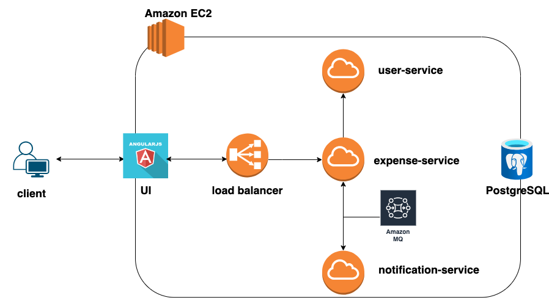
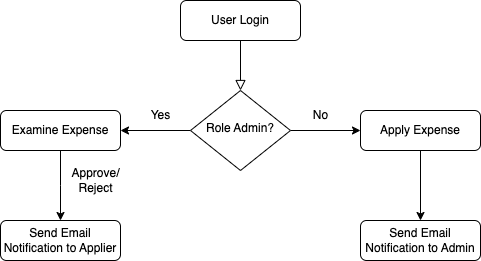
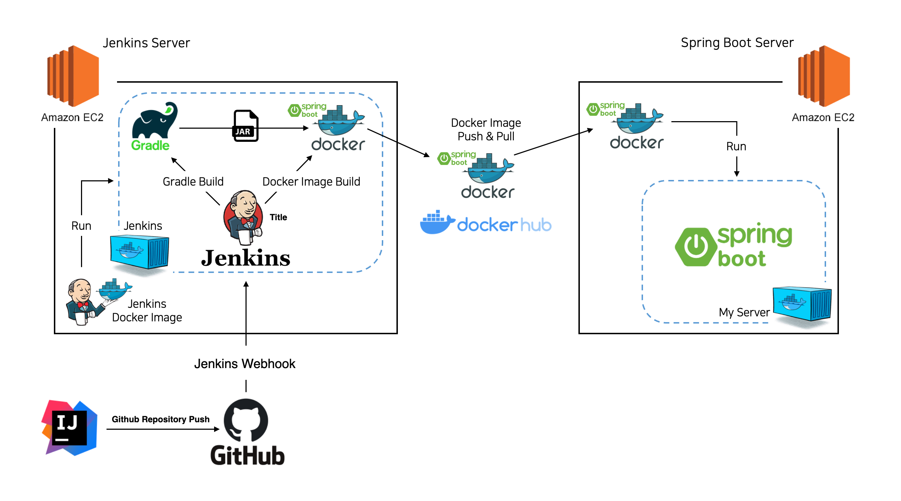

# Overview:

This [expense-application](http://ec2-13-215-209-48.ap-southeast-1.compute.amazonaws.com/) serves as a foundation for developing commonly used and scalable products in real-world scenarios. It consists of a UI service and three back-end services(user/expense/notificatoin).

## Services

- [UI](https://github.com/twinva1/application-web)

- [User service](https://github.com/JoanneChangInnova/expense-application/tree/master/user-service): Enables user creation, login, and retrieval of account information, utilizing the `CrudRepository` interface available in Spring Boot.

- [Expense service](https://github.com/JoanneChangInnova/expense-application/tree/master/expense-service):    
   1. Retrieves a list of expenses based on the provided query conditions, page number, and page size. using the Specification class from the `Spring Data JPA`.[Swagger-API](http://ec2-13-215-209-48.ap-southeast-1.compute.amazonaws.com/expense/swagger-ui/#/Expense)
   2. Expense application submission by users, with the ability to send MQ messages to the `approver-queue`.
   3. Approval or rejection of expense applications by the approver, with corresponding MQ messages sent to the `applier-queue` upon update.
   
- [Notification service](https://github.com/JoanneChangInnova/expense-application/tree/master/notification-service): 
  1. Catching MQ messages and triggering the sending of email notifications upon receiving messages from the `approver-queue`.
  2. Utilizing a CamelRouter to process emails when receiving messages from the `applier-queue`.
  
- Load Balancer:
  [nginx.conf](https://github.com/twinva1/application-web/blob/master/nginx.conf)

## Environment

- Amazon EC2 (ubuntu)
- Amazon RDS (Postgres)
- Amazon MQ (ActiveMQ)

## CI/CD

[Jenkinsfile](Jenkinsfile)
[docker-compose.yml](docker-compose.yml)
